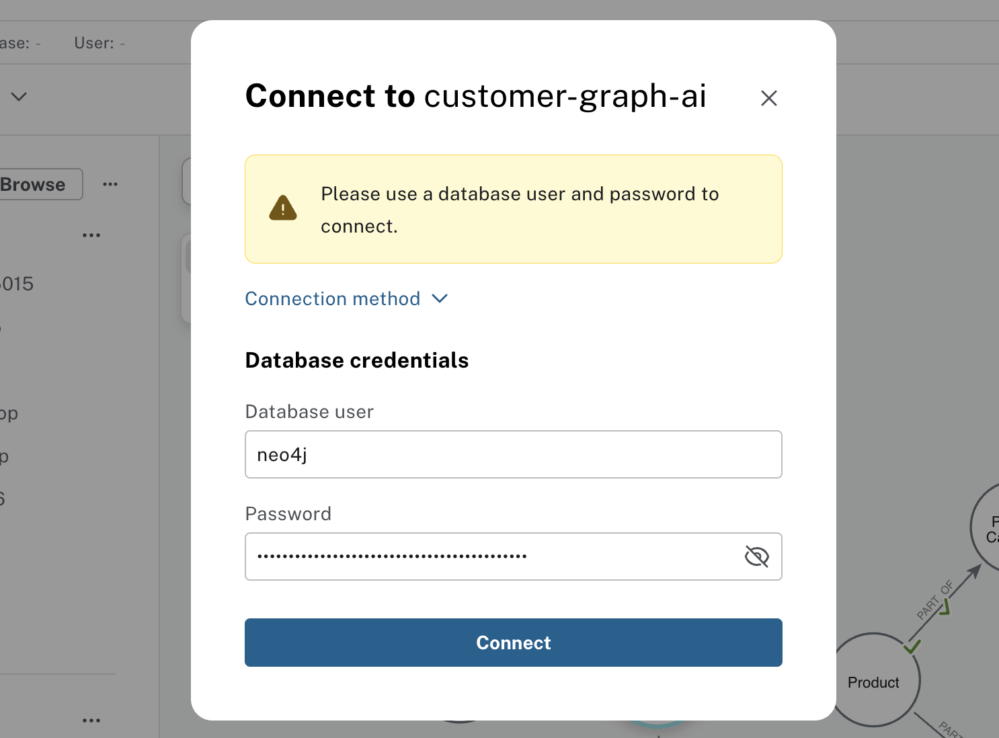
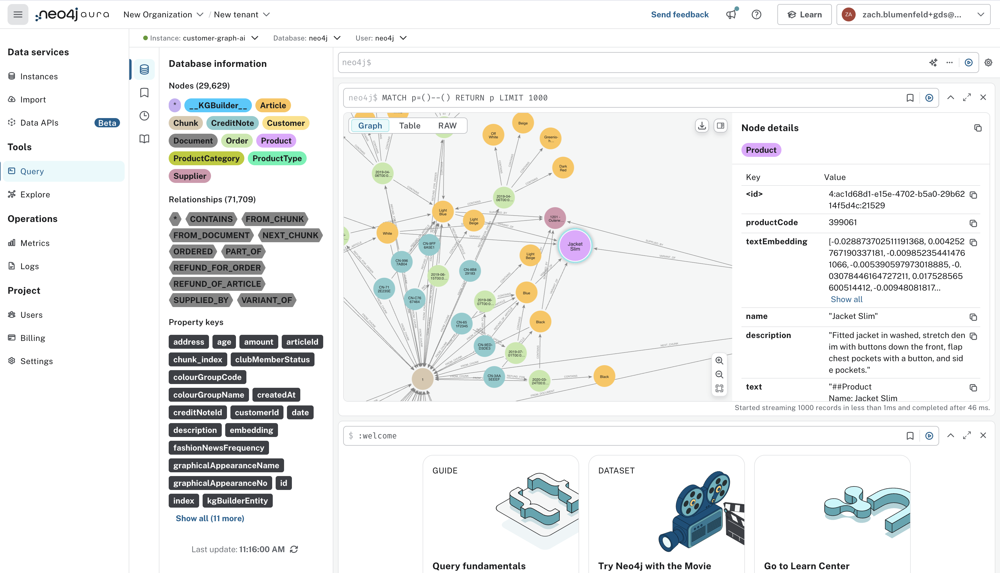

# Customer Graph Agentic GraphRAG

## Setup Neo4j DB
The workflow requires a Neo4j DB with Graph Data Science. We recommend using Aura Pro for this.  You can access a 2-week trial for free and the setup is easy. 

If you need a free version beyond those two weeks see Desktop, Server, or Docker installation instructions [here](https://neo4j.com/docs/graph-data-science/current/installation).  

## Configure Python Env
Create and activate a new python virtual environment.
```bash
python -m venv graphrag_venv
source graphrag_venv/bin/activate
```
install requirements (from root directory of this repository)

```bash
pip install -r requirements.txt
```

## Creating the Graph
Creating the graph requires ingesting unstructured then structured data, in that order. You will use schemas in the [ontos](./ontos) folder to power them.  For more information on how these schemas were generated from a central source, see the __Schema Generation__ section.

Please follow the steps in order below, going out of order may result in some conflicting deduplication and indexing issues. 

### 1) Loading Unstructured Data
Create a .env file by copying .env.template

```bash
cp .env.template .env
```
replace the Neo4j credentials and OpenAI key with your own. 

Run the unstructured ingest.  This will take a few minutes.
```bash
python unstuctured_ingest.py
```

### 2) Loading Structured Data
We will use Aura Importer for this which allows you to map structured data from csvs or other relational databases to graph. 

Go to the [Aura Console](https://console.neo4j.io/) and navigate to the Import tab


Select the ellipsis in the top left corner and then select "Open Model" in the dropdown


Choose [customer-struct-import.json](ontos/customer-struct-import.json) in the ontos folder. The resulting data model should look like the below:


Now you need to select data sources.  Aura Im port allows you to import from several types of databases, but for today we will use local csvs. Select browse at the top of the Data source panel.


Select all the csv files in the [data](data) directory. Once complete you should see green check marks on each node and relationship.  When selecting a node you should also see the mapping between node properties and columns in the csvs.


We are now ready to run the import.  Select the blue "Run import" button on the top left of the screen.  You will be prompted to select your Aura instance - select the one configured above and enter your credentials:


The import should only take a few seconds. Once complete, you should get an Import results pop-up with a "completed successfully" message and some statistics.


### 3) Post-Processing Script
The post-processing script is responsible for creating text properties, embeddings and a vector index to power search on Product nodes.  It takes a few minutes run as we need to call OpenAI embedding endpoint in batches to retrieve text embeddings.
```bash
python ingest_post_processing.py
```

Once complete go back to query in the Aura console. and run a simple query to sample the graph like the below:
```cypher
MATCH p=()--() RETURN p LIMIT 1000
```


you should now see the unstructured data, the structured data, and product text/vector properties merged together on one graph!. 


### Running the Agent
Currently the best way to run the agent is through the command line tool `cli_agent.py`. The streamlit app `app.py` is a WIP and still has some issues with hanging for multi Q&A conversations. 

To run - navigate to the graphrag folder and run the file:

```bash
cd graphrag
python cli_agent.py
```
Some sample questions to try
- What are some good sweaters for spring?  Nothing too warm please!
- Which suppliers have the highest number of returns (i.,e, credit notes)?
- What are the top 3 most returned products for supplier 1616? Get those product codes and find other suppliers who have less returns for each product I can use instead.
- Can you run a customer segmentation analysis?
- What are the most common product types purchased for each segment?
- Can you run a customer segmentation analysis? For the largest group make a creative spring promotional campaign for them highlighting recommended products.  Draft it as an email.


> ⚠️ **Warning:** Agentic AI planning & reasoning is still in early development and it may not behave consistently.  For example, it may at times choose to use different tools then you intended.  There is more work ....\[explain to go to semantic kernel docs if you want to formalize more and get more consistent behavior.  To see the use of GraphRAG with deterministic tools see customer experience example...etc. \]

### Schema Generation


